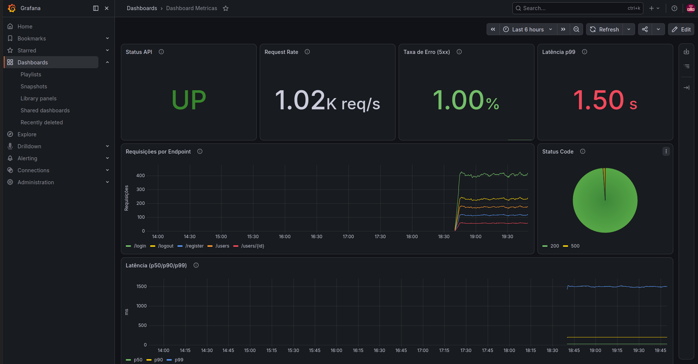

# Desafio DevOps — Stack de Observabilidade (Prometheus + Grafana + prom-http-simulator)

## Autor : Carlos Eduardo Medeiros da Silva

Stack conteinerizada de monitoramento que simula um microsserviço HTTP e visualiza suas métricas (taxa de requisições, latência e códigos de status) em um dashboard Grafana.

## Stack

- **Prometheus** — coleta e armazenamento das métricas (scrape direto).
- **Grafana** — visualização das métricas em dashboard.
- **prom-http-simulator** (`pierrevincent/prom-http-simulator`) — simula um microsserviço HTTP, expondo métricas no formato Prometheus.

## Estrutura do projeto

```
.
├── docker-compose.yml
├── grafana
│   └── provisioning
│       ├── dashboards
│       │   ├── dashboard.yml
│       │   └── simulator-dashboard.json
│       └── datasources
│           └── datasource.yml
├── LICENSE
├── prometheus
│   └── prometheus.yml
├── .env.example
├── .dockerignore
├── imgs/
└── README.md

```

## Como subir o projeto

Pré-requisitos: Docker e Docker Compose instalados.

1. Clone o repositório:
```bash
git clone <url-do-repositorio>
cd <pasta-do-projeto>
```

2. Crie um arquivo `.env` na raiz com as variáveis necessárias:
```env
SIMULATOR_CONTAINER_NAME=simulator
PROMETHEUS_CONTAINER_NAME=prometheus
PROMETHEUS_PORT=9090
PROMETHEUS_RETENTION=15d
GRAFANA_CONTAINER_NAME=grafana
GRAFANA_PORT=3000
GF_ADMIN_USER=admin
GF_ADMIN_PASSWORD=admin123
```

3. Suba a stack com um único comando:
```bash
docker-compose up -d
```

4. Acesse o Grafana em [http://localhost:3000](http://localhost:3000) com as credenciais definidas no `.env`.

## Como visualizar o dashboard

1. No Grafana, vá em **Dashboards → New → Import**.
2. Faça upload do arquivo `grafana/dashboards/simulator-dashboard.json` (ou cole o conteúdo do JSON).
3. Na tela de importação, selecione o datasource **Prometheus** quando solicitado.
4. O dashboard será criado com os painéis de status da API, taxa de requisições, taxa de erro, latência e distribuição de status code.


## Decisões técnicas

### Coleta de métricas: scrape direto do Prometheus (sem Grafana Alloy)

Optei por configurar o scrape diretamente no `prometheus.yml`, apontando para o `prom-http-simulator` como target, em vez de usar o Grafana Alloy como agente intermediário. Justificativa:

- O `prom-http-simulator` já expõe as métricas nativamente no formato Prometheus (endpoint `/metrics`), então não há necessidade de um agente de coleta/transformação entre a fonte e o Prometheus — o scrape direto já resolve o pipeline com uma peça a menos.
- Para o escopo do desafio (uma única fonte de métricas, ambiente local), adicionar o Alloy introduziria uma camada extra de configuração e um ponto a mais de falha, sem ganho prático imediato. O Alloy se justifica mais em cenários com múltiplas fontes heterogêneas de telemetria (logs, traces, métricas de fontes não nativas do Prometheus) ou pipelines de transformação/roteamento mais complexos, que não é o caso aqui.
- Manter o pipeline simples (simulator → Prometheus → Grafana) facilita a reprodução do ambiente por qualquer pessoa avaliando o desafio, sem exigir conhecimento prévio de Alloy.

### Healthchecks

Todos os três serviços têm healthcheck configurado no `docker-compose.yml`:

- **simulator**: verifica se o endpoint `/metrics` responde (`wget -qO- http://localhost:8080/metrics`).
- **prometheus**: verifica o endpoint interno de saúde (`/-/healthy`).
- **grafana**: verifica o endpoint de health da API (`/api/health`).

Os serviços dependentes usam `depends_on` com `condition: service_healthy`, garantindo que o Grafana só suba depois do Prometheus estar de fato saudável (e não apenas com o container "rodando").

### Boas práticas adotadas

- Variáveis sensíveis e de configuração (portas, nomes de container, credenciais, retenção do Prometheus) ficam em `.env`, não hardcoded no `docker-compose.yml`.
- Volumes nomeados (`prometheus-data`, `grafana-data`) garantem persistência dos dados entre reinicializações.
- Rede Docker dedicada (`monitoring`, tipo `bridge`) isola a comunicação entre os serviços da stack.
- Versões das imagens fixadas (`prom/prometheus:v3.13.0`, `grafana/grafana:13.1.0`, `pierrevincent/prom-http-simulator:0.1`) para builds reprodutíveis.

## Dashboard

O dashboard reúne os seguintes painéis, cobrindo os sinais essenciais de observabilidade de uma API (tráfego, erro, latência e disponibilidade):

| Painel | O que mostra |
|---|---|
| **Status API** | Se a API está `UP` ou `DOWN`, com base em `up{job="simulator"}`. |
| **Request Rate** | Taxa de requisições por segundo (`sum(rate(http_requests_total[5m]))`). |
| **Taxa de Erro (5xx)** | Percentual de requisições com erro de servidor em relação ao total. |
| **Latência p99** | Tempo de resposta abaixo do qual ficam 99% das requisições — evidencia a cauda longa/piores casos. |
| **Requisições por Endpoint** | Taxa de requisições separada por rota, ao longo do tempo. |
| **Status Code** | Distribuição percentual dos códigos de resposta HTTP (2xx, 4xx, 5xx). |
| **Latência (p50/p90/p99)** | Evolução dos três percentis de latência ao longo do tempo, para identificar se uma degradação é geral (p50 sobe) ou pontual/cauda longa (só p99 sobe). |



## Dificuldades encontradas e como foram resolvidas
 
- **Provisionamento automático de dashboard quebrado no Grafana 13.** A ideia inicial era que o dashboard subisse pronto junto com o `docker-compose up`, via provisionamento por arquivo estático. Na prática, isso não funcionou nessa versão do Grafana — o dashboard não era carregado automaticamente. Como contorno, o que deveria ser uma etapa totalmente automática (dashboard já disponível ao subir a stack) ficou como **importação manual**: após o `docker-compose up`, é preciso importar o `simulator-dashboard.json` pela UI (`Dashboards → Import`). Fica registrado aqui como uma limitação conhecida da solução, não como comportamento ideal.
